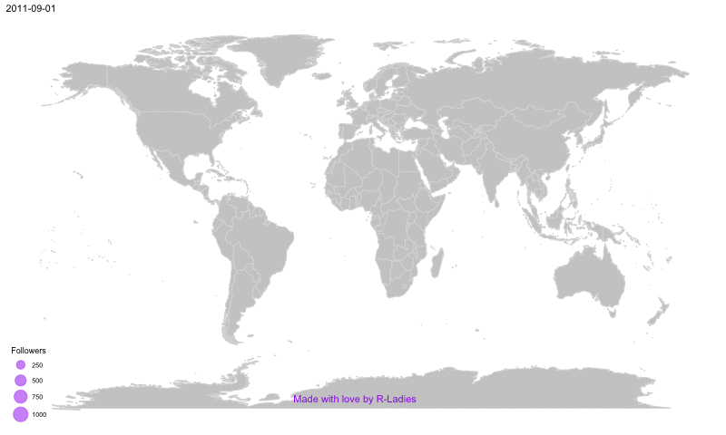
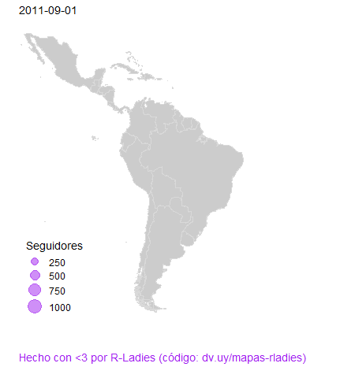
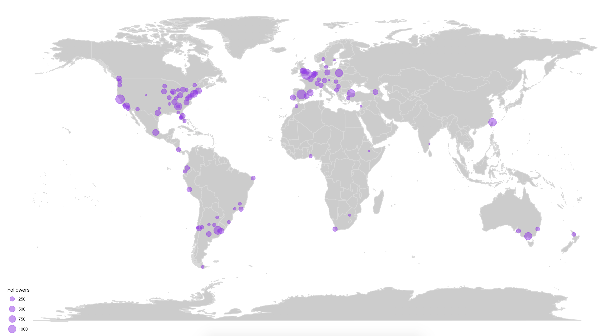

# R-Ladies is growing FAST!

(to cite, use the twitter handle: [\@d4tagirl](https://twitter.com/d4tagirl), thanks!)

___

This map was built using [`gganimate` v0.1.1](https://github.com/thomasp85/gganimate/releases/tag/v0.1.1). It breaks with the latest version.

___

Here is the code to make this animated map:

And the Latin American version :)

The ggmap package is used to access maps from the Google Maps API, and the package gganimate to make the animation.

A static map:

And there is also the code to make a Plotly one.

Note: last updated on December the 11th, 2018.
