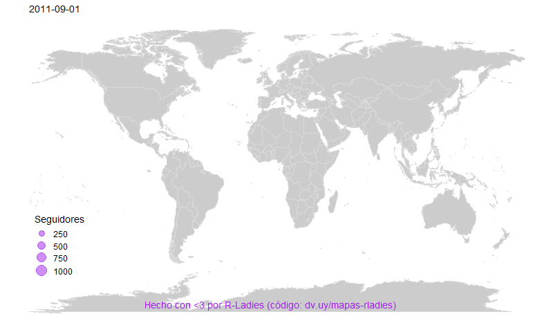
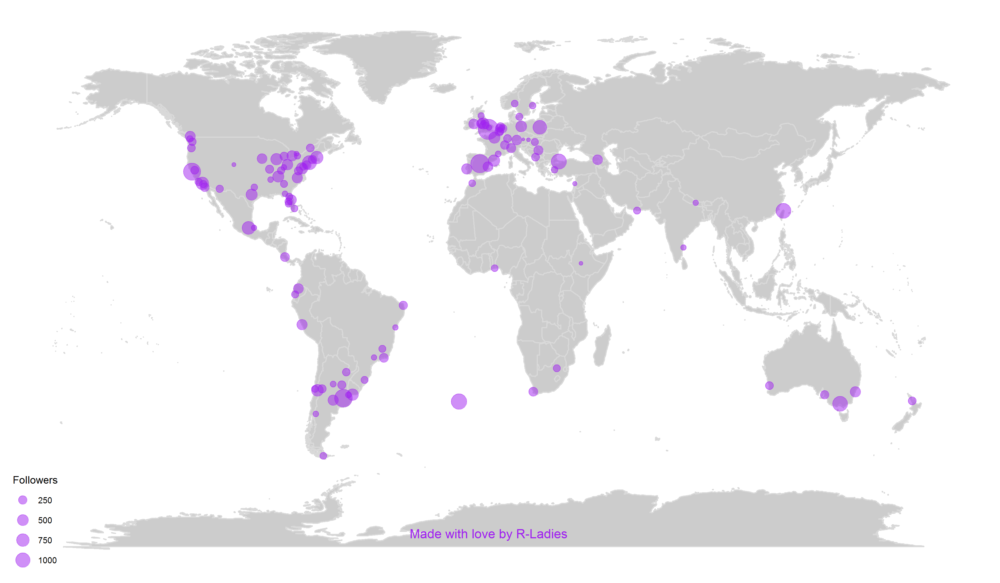

# R-Ladies is growing FAST!

(to cite, use the twitter handle: @d4tagirl, thanks!)

Here is the code to make this animated map:

And the Latin American version :)

The ggmap package is used to access maps from the Google Maps API, and the package gganimate to make the animation.

A static map:

And there is also the code to make a Plotly one.

Note: last updated on December the 11th, 2018.
